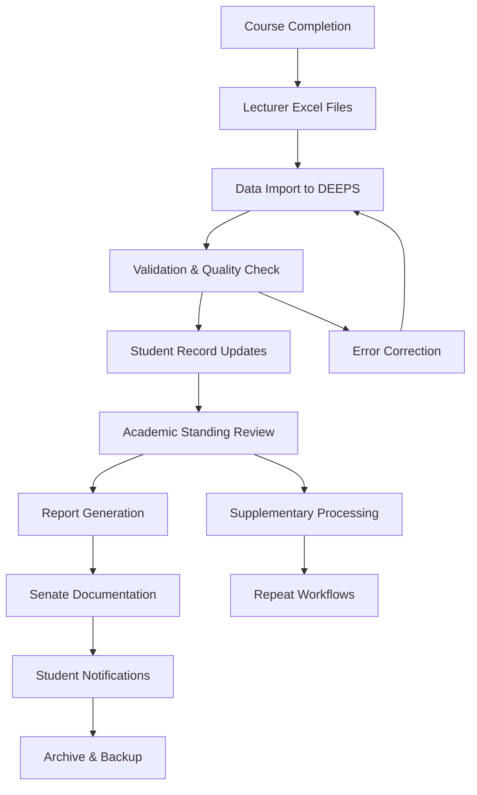

# Academic Workflow

Understand how DEEPS streamlines academic processes from data collection to official documentation.

## :material-workflow: End-to-End Academic Process

### Semester Processing Lifecycle

**Complete Academic Workflow:**



### Stakeholder Workflow Map

**Process Participants and Responsibilities:**

=== "Course Lecturers"
    **Data Collection Phase:**
    ```
    👨‍🏫 Lecturer Responsibilities:
    ├── Conduct examinations
    ├── Grade student work
    ├── Prepare Excel spreadsheets
    ├── Submit to academic office
    └── Respond to data queries
    ```

=== "Academic Staff"
    **Processing Phase:**
    ```
    👨‍💼 Academic Office Tasks:
    ├── Collect Excel files
    ├── Import data into DEEPS
    ├── Validate and clean data
    ├── Process academic standings
    └── Generate preliminary reports
    ```

=== "Registrar Office"
    **Official Documentation:**
    ```
    📋 Registrar Activities:
    ├── Review processed results
    ├── Generate official transcripts
    ├── Prepare senate documents
    ├── Handle student inquiries
    └── Maintain permanent records
    ```

=== "Senate/Administration"
    **Governance Phase:**
    ```
    🏛️ Administrative Review:
    ├── Review aggregate reports
    ├── Approve academic standings
    ├── Make policy decisions
    ├── Authorize graduations
    └── Direct interventions
    ```

---

## :material-timeline-clock: Semester Processing Timeline

### Standard Academic Calendar Integration

**Typical Processing Schedule:**

| Week | Phase | Activities | DEEPS Usage |
|------|-------|------------|-------------|
| **Exam Week** | Assessment | Examinations conducted | Data preparation |
| **Week +1** | Grading | Lecturers grade papers | Excel preparation |
| **Week +2** | Submission | Excel files submitted | Data import |
| **Week +3** | Processing | DEEPS data processing | Validation & reports |
| **Week +4** | Review | Administrative review | Final documentation |
| **Week +5** | Publication | Results published | Student notifications |

### Critical Path Management

**Process Dependencies:**

```
🎯 Critical Success Factors:
├── Timely Excel file submission
├── Data validation completion
├── Academic policy compliance
├── Quality assurance checks
├── Stakeholder approval cycles
└── System performance optimization
```

**Bottleneck Prevention:**
- Parallel processing for multiple courses
- Automated validation reduces manual review
- Template standardization speeds imports
- Batch processing optimizes system resources
- Early error detection prevents delays

---

## :material-school-outline: Academic Year Workflows

### Multi-Semester Coordination

**Year-Long Academic Management:**

=== "Semester 1"
    ```
    📅 Fall/First Semester:
    ├── New student registration
    ├── Course enrollment processing
    ├── Mid-term progress tracking
    ├── Final exam processing
    ├── Academic standing updates
    └── Progression determinations
    ```

=== "Semester 2"
    ```
    📅 Spring/Second Semester:
    ├── Returning student validation
    ├── Course prerequisite checking
    ├── Supplementary exam processing
    ├── Annual GPA calculations
    ├── Academic probation reviews
    └── Graduation eligibility
    ```

=== "Summer/Inter-Semester"
    ```
    📅 Summer/Supplementary:
    ├── Supplementary examinations
    ├── Course repeats processing
    ├── Transfer credit evaluation
    ├── System maintenance
    ├── Data archival
    └── New year preparation
    ```

### Progression Management

**Student Advancement Workflow:**

```
Student Progression Decision Tree:
├── Pass All Courses ✅
│   ├── Advance to Next Year
│   └── Update Academic Standing
├── Fail Some Courses ⚠️
│   ├── Supplementary Exams
│   ├── Course Repeats
│   └── Academic Support
├── Fail Many Courses ❌
│   ├── Academic Probation
│   ├── Repeat Full Year
│   └── Academic Counseling
└── Graduation Requirements Met 🎓
    ├── Degree Audit
    ├── Final Verification
    └── Graduation Processing
```

---

## :material-account-multiple-check: Multi-Department Coordination

### Faculty-Level Processing

**Coordinated Academic Management:**

**Engineering Faculty Example:**
```
🏗️ Faculty of Engineering:
├── Mechanical Engineering Department
│   ├── Year 1: 120 students
│   ├── Year 2: 98 students
│   ├── Year 3: 85 students
│   └── Year 4: 76 students
├── Electrical Engineering Department
│   ├── Similar year structure
│   └── Shared core courses
└── Computer Science Department
    ├── Different progression model
    └── Specialized requirements
```

### Cross-Department Dependencies

**Shared Course Management:**

| Course Type | Management | DEEPS Handling |
|-------------|------------|----------------|
| **Core Requirements** | Central coordination | Multi-department access |
| **Shared Courses** | Lead department | Cross-enrollment tracking |
| **Electives** | Department-specific | Flexible credit allocation |
| **General Education** | University-wide | Centralized processing |

---

## :material-clipboard-check: Quality Assurance Workflows

### Multi-Level Validation

**Quality Control Process:**

=== "Level 1: Automated Validation"
    ```
    🤖 System Checks:
    ├── Data format validation
    ├── Range and type checking
    ├── Duplicate detection
    ├── Consistency verification
    └── Statistical outlier flagging
    ```

=== "Level 2: Academic Review"
    ```
    👨‍🏫 Human Verification:
    ├── Grade distribution analysis
    ├── Course performance review
    ├── Student progression validation
    ├── Exception case examination
    └── Policy compliance checking
    ```

=== "Level 3: Administrative Approval"
    ```
    👨‍💼 Final Authorization:
    ├── Department head review
    ├── Registrar verification
    ├── Academic standards compliance
    ├── Documentation completeness
    └── Official approval workflow
    ```

### Error Resolution Workflows

**Systematic Error Handling:**

```
Error Resolution Process:
├── Error Detection (Automated)
├── Error Classification (System/User)
├── Priority Assignment (Critical/Minor)
├── Resolution Assignment (Role-based)
├── Correction Implementation
├── Verification Testing
└── Process Documentation
```

**Common Error Scenarios:**
- Student ID mismatches → Identity verification workflow
- Grade inconsistencies → Lecturer consultation process
- Missing prerequisites → Academic advisor intervention
- System errors → Technical support escalation

---

## :material-clock-fast) Rush Processing Workflows

### Emergency Processing Procedures

**Expedited Academic Processing:**

**Late Submission Handling:**
```
⚡ Rush Processing Protocol:
├── Priority queue assignment
├── Dedicated processing time slots
├── Accelerated validation procedures
├── Express review workflows
├── Emergency approval processes
└── Immediate notification systems
```

**Special Circumstances:**
- Medical emergencies requiring grade changes
- Technical failures during submission periods
- Administrative deadline conflicts
- External audit requirements
- Accreditation review preparations

### Disaster Recovery Workflows

**Business Continuity Planning:**

| Scenario | Response Time | Recovery Procedure | Data Protection |
|----------|--------------|-------------------|----------------|
| **System Failure** | < 4 hours | Backup restoration | Full data recovery |
| **Network Outage** | Immediate | Offline processing | Local backup access |
| **Data Corruption** | < 2 hours | Point-in-time recovery | Transaction log replay |
| **Security Breach** | < 1 hour | Isolation & investigation | Encrypted backup restore |

---

## :material-chart-gantt: Workflow Optimization

### Performance Enhancement

**Efficiency Improvements:**

```
🚀 Workflow Optimization:
├── Parallel processing implementation
├── Batch operation scheduling
├── Resource allocation optimization
├── Bottleneck identification
├── Process automation expansion
└── User experience enhancement
```

**Metrics and KPIs:**
- Processing time per semester
- Error rate reduction
- User satisfaction scores
- System availability metrics
- Data accuracy measurements

### Continuous Improvement

**Process Enhancement Cycle:**
1. **Performance Monitoring** - Track workflow metrics
2. **Bottleneck Analysis** - Identify process constraints
3. **Solution Design** - Develop improvement strategies
4. **Implementation** - Deploy optimizations
5. **Validation** - Measure improvement impact
6. **Documentation** - Update procedures and training

**Stakeholder Feedback Integration:**
- Regular user surveys
- Process improvement suggestions
- Training effectiveness evaluation
- System enhancement requests
- Workflow optimization proposals

---

*Learn about specific document types in [Report Types](reports.md) and explore system capabilities in [Core Capabilities](capabilities.md).*