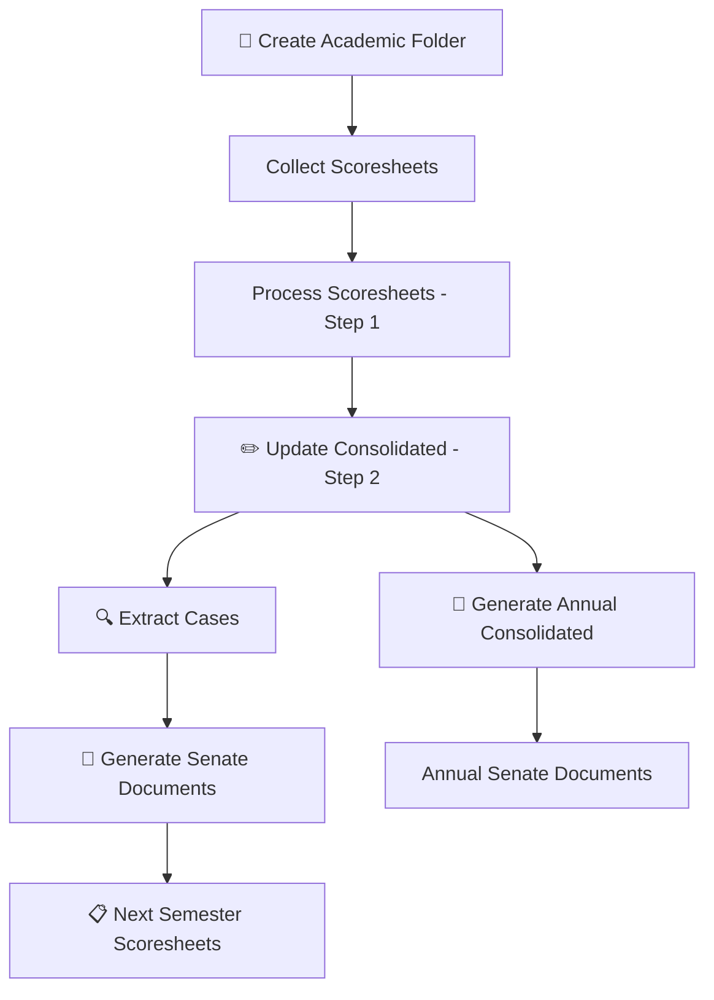

# Tools Reference

Complete guide to all DEEPS tools and features.

---

## :material-tools: Tools Overview

DEEPS provides a comprehensive set of tools for exam processing and academic administration. Each tool is designed for a specific task in the exam processing workflow.

-   📁 **[Create Academic Folder](tools/create-academic-folder.md)**

    ---

    Create standardized folder structures for new semesters, annual, or graduation periods.

    **Use for:** Starting a new semester or academic period

-   📄 **[XLSX to PDF Converter](tools/xlsx-to-pdf.md)**

    ---

    Convert Excel spreadsheets to PDF format for printing and distribution.

    **Use for:** Creating print-ready documents

-   📑 **[Sheet Extractor](tools/sheet-extractor.md)**

    ---

    Extract specific sheets from multi-sheet Excel workbooks into separate files.

    **Use for:** Sharing individual unit data with lecturers

-   ✏️ **[Update Consolidated](tools/update-consolidated.md)**

    ---

    Edit and recalculate existing consolidated results files.

    **Use for:** Correcting marks or adding missing students

-   🔍 **[Extract Cases](tools/extract-cases.md)**

    ---

    Extract students by case type (Pass, Supp, Retake, etc.) into separate files.

    **Use for:** Creating case-specific lists for administration

-   🔎 **[Student Search](tools/student-search.md)**

    ---

    Search and view individual student records across all processed semesters.

    **Use for:** Looking up student academic history

-   📋 **[Next Semester Scoresheets](tools/next-semester-scoresheets.md)**

    ---

    Generate empty scoresheet templates with student lists pre-filled.

    **Use for:** Preparing templates for lecturers

-   📜 **[Generate Senate Documents](tools/generate-senate-documents.md)**

    ---

    Create official senate documents from processed exam results.

    **Use for:** Preparing results for senate approval

-   📅 **[Generate Annual Consolidated](tools/generate-annual-consolidated.md)**

    ---

    Combine both semester results into an annual consolidated summary.

    **Use for:** Year-end processing and progression decisions

-   ✅ **[Check Missing Data](tools/check-missing-data.md)**

    ---

    Verify data completeness by checking for missing folders and files.

    **Use for:** Auditing data integrity and completeness

---

## :material-menu: Menu Structure

### File Menu

| Item | Shortcut | Description |
|------|----------|-------------|
| **Open Input Folder...** | `Ctrl+O` | Select a semester folder for processing |
| **Settings...** | `Ctrl+,` | Configure DEEPS settings |
| **Exit** | `Ctrl+Q` | Close DEEPS |

### View Menu

| Item | Description |
|------|-------------|
| **Course Syllabus...** | View configured course units in tree format |
| **Unit Assessments...** | View assessment breakdown for each unit |
| **Engineering Rules...** | View rules and regulations for citations |
| **Calculation Rules...** | View grade calculation rules |
| **Case Decision Rules...** | View case decision engine configuration |
| **Raw Auto-generated Files...** | Open the `.raw` output folder |
| **Clear Log** | Clear the processing log panel |

### Tools Menu

| Icon | Item | Description | Page |
|:----:|------|-------------|:----:|
| 📁 | **Create Academic Folder...** | Create folder structure | [:octicons-arrow-right-24:](tools/create-academic-folder.md) |
| 📄 | **XLSX to PDF Converter...** | Convert Excel to PDF | [:octicons-arrow-right-24:](tools/xlsx-to-pdf.md) |
| 📑 | **Sheet Extractor...** | Extract sheets from workbooks | [:octicons-arrow-right-24:](tools/sheet-extractor.md) |
| ✏️ | **Update Consolidated...** | Edit consolidated files | [:octicons-arrow-right-24:](tools/update-consolidated.md) |
| 🔍 | **Extract Cases...** | Extract by case type | [:octicons-arrow-right-24:](tools/extract-cases.md) |
| 🔎 | **Student Search...** | Search student records | [:octicons-arrow-right-24:](tools/student-search.md) |
| 📋 | **Next Semester Scoresheets...** | Generate templates | [:octicons-arrow-right-24:](tools/next-semester-scoresheets.md) |
| 📜 | **Generate Senate Documents...** | Create senate docs | [:octicons-arrow-right-24:](tools/generate-senate-documents.md) |
| 📅 | **Generate Annual Consolidated...** | Combine semesters | [:octicons-arrow-right-24:](tools/generate-annual-consolidated.md) |
| 🗂️ | **Exam Question Paper Submission...** | Track question paper and marking scheme submission and moderation | |
| ✅ | **Check Missing Data...** | Verify data integrity | [:octicons-arrow-right-24:](tools/check-missing-data.md) |

### License Menu

| Item | Description |
|------|-------------|
| **License Status** | Shows current license status indicator |
| **License Details...** | View detailed license information |
| **Renew License** | Open donation/renewal page |

### Help Menu

| Item | Description |
|------|-------------|
| **Documentation** | Open online documentation |
| **File Requirements...** | View scoresheet format requirements |
| **About DEEPS** | Version, credits, and support info |

---

## :material-keyboard: Keyboard Shortcuts

| Shortcut | Action |
|----------|--------|
| `Ctrl+O` | Open Input Folder |
| `Ctrl+,` | Open Settings |
| `Ctrl+Q` | Exit |
| `F5` | Process Scoresheets |
| `Ctrl+L` | Clear Log |

---

## :material-file-tree: File Naming Conventions

DEEPS uses consistent file naming with the academic year prefix:

| File Type | Example |
|-----------|---------|
| **Consolidated (Semester)** | `2024_2025_YR3_SEM1_consolidated_verified.xlsx` |
| **Consolidated (Annual)** | `2024_2025_YR3_annual_consolidated.xlsx` |
| **Senate Document** | `2024_2025_YR3_SEM1_senate_document.docx` |
| **Raw Auto-generated** | Stored in hidden `.raw/` folder |

!!! info "Raw vs Verified Files"
    - **Verified Results** (`outputs/verified_results/`) - Working copies you edit and verify
    - **Raw Files** (`outputs/.raw/`) - Auto-generated backups, do not edit

---

## :material-chart-timeline: Typical Workflow

The tools are designed to support this typical exam processing workflow:

!!! tip "Workflow Summary"
    1. **📁 [Create Academic Folder](tools/create-academic-folder.md)** - Set up folder structure
    2. **Collect scoresheets** - Get completed scoresheets from lecturers
    3. **Process** - Run Step 1 processing from main window
    4. **✏️ [Update Consolidated](tools/update-consolidated.md)** - Review and correct results (Step 2)
    5. **🔍 [Extract Cases](tools/extract-cases.md)** - Create case-specific lists
    6. **📜 [Generate Senate Documents](tools/generate-senate-documents.md)** - Prepare for senate
    7. **📋 [Next Semester Scoresheets](tools/next-semester-scoresheets.md)** - Prepare for next semester
    8. **📅 [Generate Annual Consolidated](tools/generate-annual-consolidated.md)** - After both semesters

---

## :material-help-circle: Getting Help

-   :material-book-open-variant: **Documentation**

    ---

    Full documentation available online

    [:octicons-arrow-right-24: siliconwit.github.io/deeps](https://siliconwit.github.io/deeps/)

-   :material-frequently-asked-questions: **FAQ**

    ---

    Frequently asked questions

    [:octicons-arrow-right-24: FAQ](../support/faq.md)

-   :material-email: **Support**

    ---

    Contact the development team

    [:octicons-arrow-right-24: Contact](../support/contact.md)

